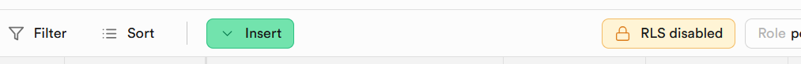
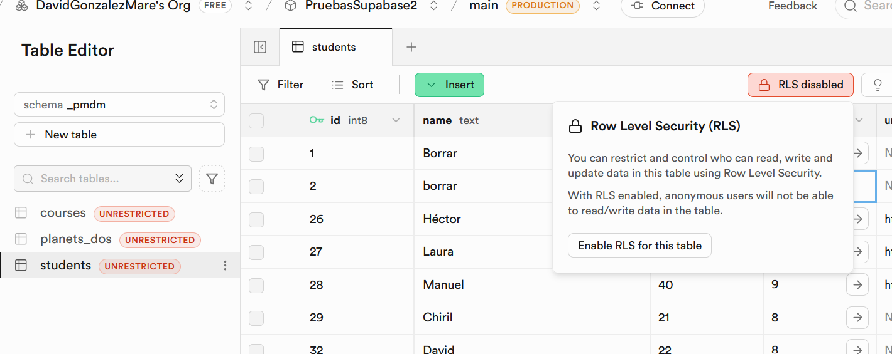
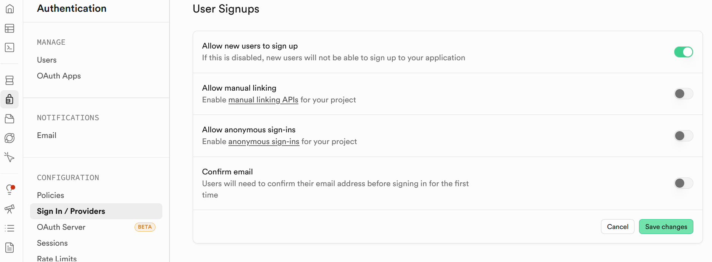
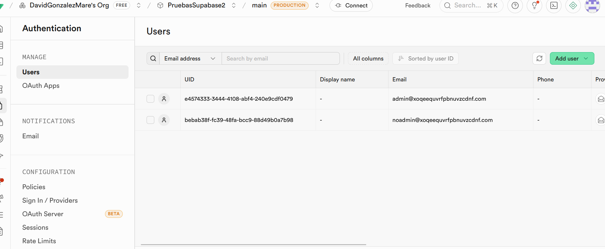
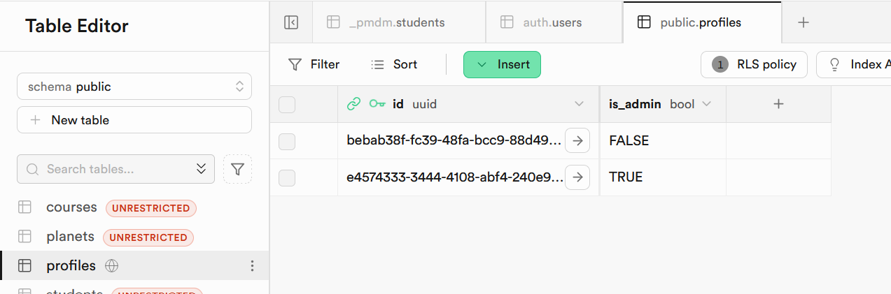
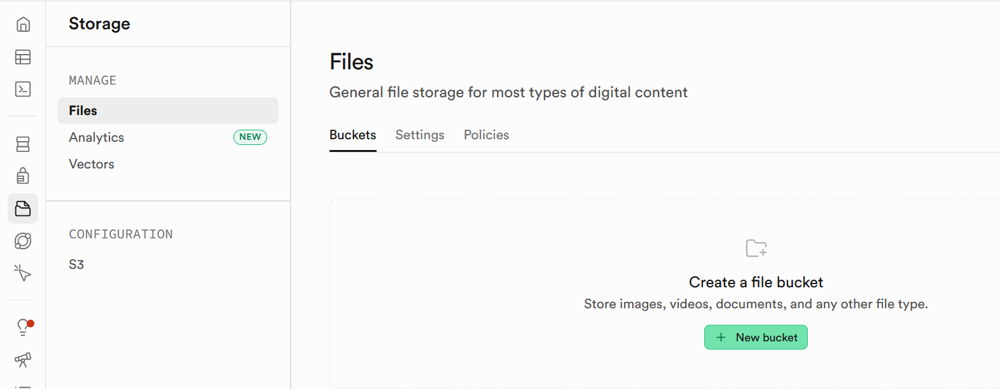
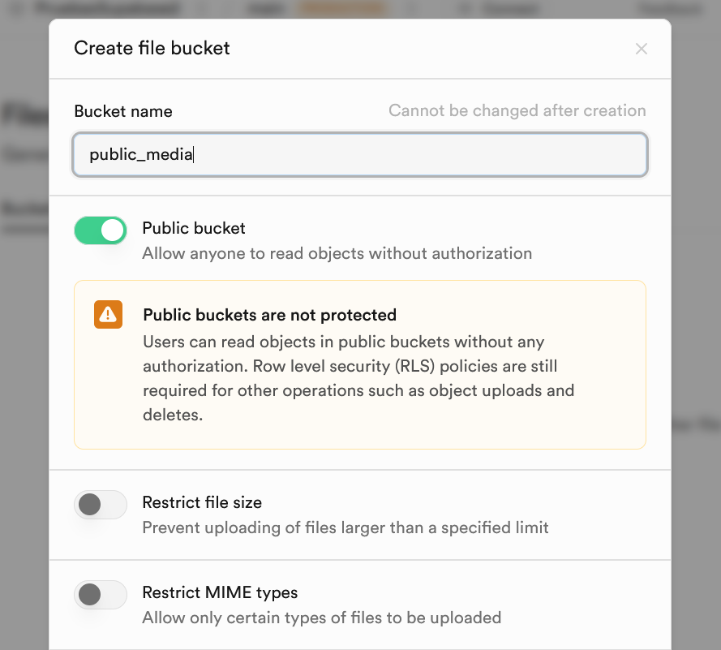
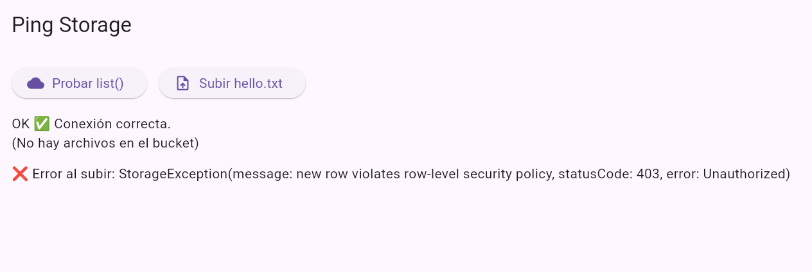
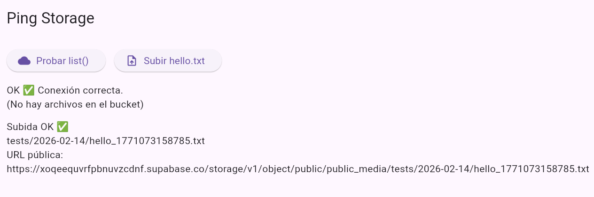
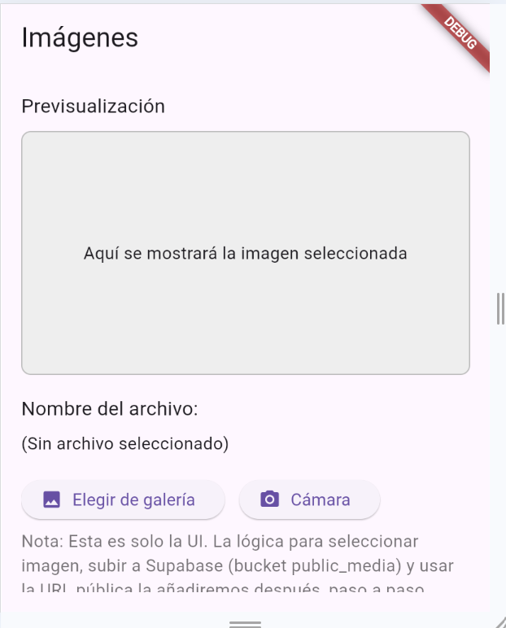

# Unidad 9. Autenticación con Supabase en una aplicación Flutter.

[1. Introducción](#_apartado1)

[2. Activando RLS y Autenticación](#_apartado2)

[3. Modelo. Clase Planeta](#_apartado3)

[4. Data Source](#_apartado4)

[5. Repositorio y Provider](#_apartado5)

[6. Interfaz](#_apartado6)

[7. Posibles mejoras](#_apartado7)

[8. Supabase Storage](#_apartado8)

<br>
<br>

# <a name="_apartado1"></a>1. Introducción

Como vimos en el tema anterior *Supabase* es una plataforma de código abierto que utiliza *PostgreSQL* como base de datos. 
Además, proporciona una serie de herramientas y servicios para gestionar usuarios y sus permisos, facilitando la creación de sistemas de autenticación y autorización seguros

## ¿Para qué sirve la autenticación con Supabase?

La autenticación con Supabase se utiliza para verificar la identidad de los usuarios que acceden a tu aplicación. Esto es crucial para asegurar que solo los usuarios autorizados puedan acceder a ciertos recursos o realizar acciones específicas. Supabase ofrece varias formas de autenticación, incluyendo:

- **Contraseña**: Los usuarios pueden registrarse y acceder utilizando un correo electrónico y una contraseña.
  
- **Enlace mágico**: Los usuarios reciben un enlace en su correo electrónico que les permite acceder sin necesidad de una contraseña.
- **OTP (One-Time Password)**: Contraseñas de un solo uso enviadas por SMS o correo electrónico
- **Inicio de sesión social**: Integraciones con proveedores como Google, Facebook, GitHub, entre otros.
- **SSO (Single Sign-On)**: Autenticación única para acceder a múltiples aplicaciones.
  
## Generalidades de la autenticación con Supabase
- **Tokens JWT**: Supabase utiliza JSON Web Tokens (JWT) para la autenticación. Estos tokens contienen información sobre el usuario y se envían con cada solicitud para verificar la identidad del usuario 1
  
- **Seguridad a nivel de fila (RLS)**: Supabase permite definir políticas de seguridad a nivel de fila en la base de datos, lo que significa que puedes controlar el acceso a los datos a nivel de cada fila en una tabla.
- **Integración con el ecosistema de Supabase**: La autenticación está diseñada para integrarse perfectamente con otros servicios de Supabase, como la base de datos y las funciones de almacenamiento.
- **Facilidad de uso**: Supabase proporciona SDKs y API endpoints que simplifican la implementación de la autenticación en tu aplicación.


## Empezamos
Para empezar a trabajar con la autenticación de Supabase en Flutter vamos a utilizar la aplicación de estudiantes que implementamos en el tema anterior y que ya tenía una BD en Supabase.
Recordemos que a la tabla con la que trabajabamos en esa aplicación 

Nuestra aplicación trabaja con la tabla `students` que habíamos definido en nuestra BD de Supabase y a la cuál habíamos desactivado **RLS (Row Level Security - Seguridad a Nivel de Fila)**. Es una característica de PostgreSQL que Supabase utiliza para controlar qué filas de una tabla puede acceder un usuario. Esto se logra definiendo políticas que filtran las filas visibles para un usuario según su identidad u otros atributos

Volvemos a activarlo y posteriormente definiremos esas políticas para permitir o no el acceso a las filas de nuestra tabla según el usuario esté autenticado o no.



# <a name="_apartado2"></a>2. Activando RLS y Autenticación

Vamos en primer lugar a activar RLS en nuestra tabla. Además lo vamos a hacer para que incluso estando activado podamos seguir accediendo a la misma. Para ello, en supabase activamos RLS para nuestra tabla students:




### Empezamos con la Autenticación

En Supabase nos vamos a la opción Authentication ->Sign in/Providers y dejamos las opciones así:



Vamos a crear una nueva tabla profiles que tendrá una relación 1:1 con auth.users y nos permitirá tener el rol admin para el/los usuarios que nos interese.

Para ello ejecutamos en SQL Editor:

```sql
create table if not exists public.profiles (
  id uuid primary key references auth.users(id) on delete cascade,
  is_admin boolean not null default false
);

```

También vamos a ejecutar la siguiente sentencia:

```sql
create or replace function public.handle_new_user()
returns trigger
language plpgsql
security definer
as $$
begin
  insert into public.profiles (id, is_admin)
  values (new.id, false)
  on conflict (id) do nothing;
  return new;
end;
$$;

drop trigger if exists on_auth_user_created on auth.users;

create trigger on_auth_user_created
after insert on auth.users
for each row execute function public.handle_new_user();
```

Con esto conseguiremos que cuando se cree en nuestra app un nuevo usuario, **automáticamente** lo ponga en nuestra tabla `profiles` con `is_admin` a `false`


### Políticas de acceso a nuestras tablas

La siguiente sentencia SQL va a permitir que cualquier usuario autenticado pueda hacer select:

```sql
create policy students_select_auth
on _pmdm.students
for select
to authenticated
using ( true );
```

Y creamos las políticas para que solo los usuarios que sean administrador puedan hacer el resto de operaciones CRUD:

```sql
-- INSERT solo admin (se usa WITH CHECK)
create policy students_insert_admin
on _pmdm.students
for insert
to authenticated
with check (
  exists (
    select 1 from public.profiles p
    where p.id = auth.uid()
      and p.is_admin = true
  )
);

-- UPDATE solo admin (se usa USING y WITH CHECK)
create policy students_update_admin
on _pmdm.students
for update
to authenticated
using (
  exists (
    select 1 from public.profiles p
    where p.id = auth.uid()
      and p.is_admin = true
  )
)
with check (
  exists (
    select 1 from public.profiles p
    where p.id = auth.uid()
      and p.is_admin = true
  )
);

-- DELETE solo admin (se usa USING)
create policy students_delete_admin
on _pmdm.students
for delete
to authenticated
using (
  exists (
    select 1 from public.profiles p
    where p.id = auth.uid()
      and p.is_admin = true
  )
);

```

Si activamos RLS en la tabla `profiles` debemos dar permisos también:

```sql
create policy profiles_select_own
on public.profiles
for select
to authenticated
using ( id = auth.uid() );
```

<br>

# <a name="_apartado3"></a>3. Adaptamos nuestro código

### Pasamos la inicialización del cliente de Supabase al main

Para evitar errores posteriores por doble inicialización del cliente vamos a pasar la misma al main, quitándola de nuestro repositorio:

En el fichero `main.dart`:

CAMBIAR ANON KEY AQUÍ

```dart

Future<void> main() async {
      await Supabase.initialize(
      url: 'https://poneraquilaurlvuestra.supabase.co',
      anonKey:
          'poner aqui vuestra clave anon',
    );

  runApp(const MainApp());
}

```

**Nota importante**

Supabase Flutter conserva automáticamente la sesión del usuario entre reinicios de la app.
Si el usuario ya estaba autenticado antes de cerrar la aplicación,
`Supabase.instance.client.auth.currentUser` no será `null` al iniciarse de nuevo.

### Adaptamos nuestro repositorio y provider

Ya que nuestro cliente de Supabase lo inicializamos en el repositorio (que recordemos que sigue un patrón Singleton), vamos a adaptarlo para que llame a las funciones de authoritation necesarias para trabajar en nuestra app. 

En nuestro fichero `repository/app_respository.dart`, cambiamos la función conectaDB:

```dart
  // Inicialización de DataSource
  Future<void> connectaDB() async {
    if (_initialized) return;

    _dataSource = DataSource(Supabase.instance.client);
    _initialized = true;
  }
```

Y añadimos las siguientes funciones:

```dart

  Future<void> _ensureInit() async {
    if (!_initialized) {
      await connectaDB();
    }
  }

  //──────────────────────────────────────────────────────────────
  // AUTH
  //──────────────────────────────────────────────────────────────
  Future<void> login({required String email, required String password}) async {
    await _ensureInit();
    await Supabase.instance.client.auth.signInWithPassword(
      email: email,
      password: password,
    );
  }

  Future<void> register({required String email, required String password}) async {
    await _ensureInit();
    await Supabase.instance.client.auth.signUp(
      email: email,
      password: password,
    );
  }

  Future<void> signOut() async {
    await _ensureInit();
    await Supabase.instance.client.auth.signOut();
  }

    // Función para saber si el usuario actual es admin
  Future<bool> isCurrentUserAdmin() async {
    await _ensureInit();
    final user = Supabase.instance.client.auth.currentUser;
    if (user == null) return false;
    final row = await Supabase.instance.client
        .from('profiles')
        .select('is_admin')
        .eq('id', user.id)
        .single();
    return (row['is_admin'] == true);
  }
```

En el `provider` añadiremos una propiedad para poder saber si el usuario actual es administrador, llamando a esta última función del repositorio:

```dart
// En app_provider.dart
bool _isAdmin = false;
bool get isAdmin => _isAdmin;

// Llama a esto tras login (o al iniciar si hay sesión)
Future<void> loadAdminFlag() async {
  _isAdmin = await _repository.isCurrentUserAdmin();
  notifyListeners();
}
```

y añadimos línea a `init`:

```dart 
Future<void> _init() async {
  await _repository.connectaDB();
  await loadAdminFlag();            // <-- añade esto
  _students = await _repository.getAllStudents();
  notifyListeners();
}
```

y por último añadimos las funciones de login y register:

```dart
  Future<void> login(String email, String password) async {
    await _repository.login(email: email, password: password);
    await loadAdminFlag();
    await refreshStudents(); // 👈 recarga ahora que ya hay sesión
  }

  // Esto nos sirve para registro sin confirmación
  Future<void> registerAndLogin(String email, String password) async {
    await _repository.register(email: email, password: password);
    await loadAdminFlag(); // si tu proyecto está sin confirmación, hay sesión tras el signUp
  }
```

<br>

# <a name="_apartado4"></a>4. Creación de una pantalla de login

Vamos a realizar una pantalla de login que se llamará al principio de la app:

```dart
import 'package:flutter/material.dart';
import 'package:supabase_flutter/supabase_flutter.dart';

class LoginScreen extends StatefulWidget {
  const LoginScreen({super.key});

  @override
  LoginScreenState createState() {
    return LoginScreenState();
  }
}

class LoginScreenState extends State<LoginScreen> {
  final GlobalKey<FormState> _formKey = GlobalKey<FormState>();
  final TextEditingController _controladorName = TextEditingController();
  final TextEditingController _controladorPassword = TextEditingController();

  bool _loading = false;

  @override
  void initState() {
    super.initState();
    _controladorName.text = "";
    _controladorPassword.text = "";
  }

  @override
  void dispose() {
    _controladorName.dispose();
    _controladorPassword.dispose();
    super.dispose();
  }

  // --- CAMPOS DEL FORM ---

  TextFormField createRegisterNameFormField() {
    return TextFormField(
      controller: _controladorName,
      validator: (value) {
        if (value?.isEmpty ?? true) {
          return 'No puede estar vacío';
        }
        // Regex de email correcta (sencilla y robusta para clase)
        final regexCorreu = RegExp(r'^[^\s@]+@[^\s@]+\.[^\s@]+$');
        if (!regexCorreu.hasMatch(value!.trim())) {
          return 'La dirección de correo no es válida';
        }
        return null;
      },
      decoration: InputDecoration(
        border: OutlineInputBorder(borderRadius: BorderRadius.circular(10)),
        icon: const Icon(Icons.email),
        labelText: "Correo electrónico",
      ),
      keyboardType: TextInputType.emailAddress,
      textInputAction: TextInputAction.next,
    );
  }

  TextFormField createRegisterPasswordFormField() {
    return TextFormField(
      controller: _controladorPassword,
      obscureText: true,
      validator: (value) {
        if (value?.isEmpty ?? true) {
          return 'No puede estar vacío';
        }
        return null;
      },
      decoration: InputDecoration(
        border: OutlineInputBorder(borderRadius: BorderRadius.circular(10)),
        icon: const Icon(Icons.lock),
        labelText: "Contraseña",
      ),
      textInputAction: TextInputAction.done,
      onFieldSubmitted: (_) => _onSubmit(),
    );
  }

  // --- BOTÓN SUBMIT ---

  Widget createSubmitButton(BuildContext context) {
    return Padding(
      padding: const EdgeInsets.symmetric(vertical: 16.0),
      child: ElevatedButton(
        onPressed: _loading ? null : _onSubmit,
        style: ElevatedButton.styleFrom(
          shape:
              RoundedRectangleBorder(borderRadius: BorderRadius.circular(8.0)),
          padding: const EdgeInsets.symmetric(horizontal: 32.0, vertical: 16.0),
        ),
        child: _loading
            ? const SizedBox(
                height: 18,
                width: 18,
                child: CircularProgressIndicator(strokeWidth: 2))
            : const Text('Iniciar sesión'),
      ),
    );
  }

  Future<void> _onSubmit() async {
    if (!(_formKey.currentState?.validate() ?? false)) return;

    final email = _controladorName.text.trim();
    final pass = _controladorPassword.text.trim();

    setState(() => _loading = true);
    try {
      final appProvider = Provider.of<AppProvider>(context, listen: false);
      await appProvider.login(
          email, pass); // el provider llama al repo y hace loadAdminFlag()

      if (!mounted) return;

      // Mensaje de bienvenida (opcional)
      ScaffoldMessenger.of(context).showSnackBar(
        SnackBar(content: Text('Bienvenido: $email')),
      );

      // Navega a /students y limpia el back stack
      Navigator.of(context)
          .pushNamedAndRemoveUntil('/students', (route) => false);
          
    } on AuthException catch (e) {
      ScaffoldMessenger.of(context).showSnackBar(
        SnackBar(content: Text('No se ha podido autenticar: $email')),
      );

    } catch (e) {
      ScaffoldMessenger.of(context).showSnackBar(
        SnackBar(content: Text('Error inesperado $e')),
      );
      debugPrint('Error $e');
    } finally {
      if (mounted) setState(() => _loading = false);
    }
  }

  // --- UI PRINCIPAL ---

  @override
  Widget build(BuildContext context) {
    return Scaffold(
      body: Padding(
        padding: const EdgeInsets.all(8.0),
        child: Center(
          child: SingleChildScrollView(
            child: Card(
              shape: RoundedRectangleBorder(
                  borderRadius: BorderRadius.circular(16.0)),
              elevation: 8.0,
              child: Padding(
                padding: const EdgeInsets.all(16.0),
                child: Form(
                  key: _formKey,
                  child: Column(
                    children: <Widget>[
                      const Text(
                        'Iniciar Sesión',
                        style: TextStyle(
                            fontSize: 24.0, fontWeight: FontWeight.bold),
                      ),
                      const SizedBox(height: 16.0),
                      const SizedBox(height: 16.0),
                      createRegisterNameFormField(),
                      const SizedBox(height: 16.0),
                      createRegisterPasswordFormField(),
                      createSubmitButton(context),
                    ],
                  ),
                ),
              ),
            ),
          ),
        ),
      ),
    );
  }
}
```

### Probamos nuestra app hasta el momento

Vamos a añadir dos usuarios. Uno con el rol admin y otro sin.



Los añadimos a la tabla de profiles:



Ahora debemos entrar con uno y otro usuario y **comprobar** que, en ambos nos permiten ver la lista de usuarios, pero únicamente podemos insertar, borrar o en su caso editar si somos administradores.

<br>

# <a name="_apartado5"></a>5. Mejoras en la interfaz

### Mostrar u "ocultar" elementos de la interfaz según el rol

Si hemos probado correctamente el apartado anterior, debemos ser conscientes que cuando un usuario no es administrador, no puede añadir o eliminar estudiantes.

Puede ser una buena práctica "ocultar" los widgets que dan acceso a esas opciones.

Recordemos que en `AppProvider` tenemos un getter `isAdmin` que nos indica si el usuario loggeado actualmente es administrador.

Podemos, por ejemplo ocultar el botón de añadir según el rol. Así en nuestra pantalla de estudiantes:

```dart
      floatingActionButton:
          appProvider.isAdmin ? _myFloatingActionButton(appProvider) : null,
```

Se deja pendiente ocultar el icono de eliminar estudiante.

### Pantalla inicial 

Cuando entramos a la app, flutter mantiene la **última sesión abierta**. Es decir, puede que hayamos entrado con un usuario y ese usuario estará desde el principio activo.

Podemos cambiar nuestro `main`, para que no vaya directamente al login, dependiendo de si hay una sesión abierta o no. :

```dart
Future<void> main() async {
  await Supabase.initialize(
    url: 'url',
    anonKey:
        'anonKey',
  );

  // Comprobamos si hay un usuario ya logeado
  final bool isLoggedIn = Supabase.instance.client.auth.currentSession != null;

  runApp(MainApp(isLoggedIn: isLoggedIn));
}

class MainApp extends StatelessWidget {
  final bool isLoggedIn;

  const MainApp({super.key, required this.isLoggedIn});

  @override
  Widget build(BuildContext context) {
    return ChangeNotifierProvider(
      create: (BuildContext context) => AppProvider(),
      child: MaterialApp(
          debugShowCheckedModeBanner: false,
          title: 'App con BD de Estudiantes',
          initialRoute: isLoggedIn ? '/students' : '/auth',
          routes: {
            '/auth': (context) => const LoginScreen(),
            '/students': (context) => const StudentsScreen(),
          }),
    );
  }
}
```

Supabase recomienda otra posible forma de hacer esto, mediante un widget AuthGate:

```dart
class MainApp extends StatelessWidget {

  const MainApp({super.key, });

  @override
  Widget build(BuildContext context) {
    return ChangeNotifierProvider(
      create: (BuildContext context) => AppProvider(),
      child: MaterialApp(
          debugShowCheckedModeBanner: false,
          title: 'App con BD de Estudiantes',
          home: const AuthGate(),  // 👈 Aquí empieza todo
          routes: {
            '/auth': (context) => const LoginScreen(),
            '/students': (context) => const StudentsScreen(),
            //'/courses': (context) => const CoursesScreen(),
          }),
    );
  }
}

class AuthGate extends StatelessWidget {
  const AuthGate({super.key});

  @override
  Widget build(BuildContext context) {
    final session = Supabase.instance.client.auth.currentSession;

    if (session != null) {
      return const StudentsScreen();  // 👈 va directo a estudiantes
    }

    return const LoginScreen();        // 👈 va al login
  }

```

Esto, de momento, no funciona con la versión web, porque supabase no localiza bien al principio si hay una sesión abierta en el navegador...sí funciona en dispositivo Android.

### Cerrar sesión

Vamos a aprender en este apartado cómo cerrar la sesión.

Recordemos que en el app_repository.dart habíamos creado la función para cerrar sesión de Auth:

```dart
  Future<void> signOut() async {
    await _ensureInit();
    await Supabase.instance.client.auth.signOut();
  }
```

y creamos en nuestro Provider la función correspondiente:

```dart
  Future<void> logout() async {
    await _repository.signOut();
    _isAdmin = false; // Limpia flag de admin
    _students = []; // Limpia la lista en memoria
    notifyListeners();
  }
```

Y, por ejemplo, añadimos un icono de Logout en nuestra appBar:

```dart
    actions: [
      IconButton(
        icon: const Icon(Icons.logout),
        onPressed: () async {
          await appProvider.logout();

          if (!context.mounted) return;

          Navigator.of(context)
              .pushNamedAndRemoveUntil('/auth', (_) => false);
        },
      ),
    ],
```

<br>

# <a name="_apartado6"></a>6. Trabajo con API Rest

Recordemos que en el tema anterior estuvimos adaptando la app para poder trabajar con API Rest.
Vamos a hacerlo con la autorización.

### Creamos interfaz DataSource

Para poder unificar en un solo repositorio, vamos a crear una interfaz que luego se implementará en el DataSource para cliente de supabase y en el DataSource para API Rest:

```dart
abstract class DataSource {
  Future<List<Student>> getAll();
  Future<void> insert(Student s);
  Future<void> delete(int id);
  // Extiende con update, filtros, etc.
}
```

### DataSourceCliente

```dart
class DataSourceCliente implements DataSource{
  final SupabaseClient client;
  // Para trabajar con schema. De momento en el esquema public
  final String _schemaName = 'public';  
  final String _tableStudents = 'students';

  DataSourceCliente(this.client);

  // Métodos con la tabla de estudiantes

  // Este es el Stream. No lo he probado, pero debería funcionar.
  Stream<List<Student>> streamAllStudents() {
    // El método stream devuelve un Stream de la tabla 'students'
    final response = client
        .schema(_schemaName)
        .from(_tableStudents)
        .stream(primaryKey: ['id']);

    return response.map((event) {
      // Mapeamos el resultado a una lista de estudiantes
      return event.map((user) => Student.fromMap(user)).toList();
    });
  }

  @override
  Future<List<Student>> getAllStudents() async {
    try {
      final response = await client
          .schema(_schemaName)
          .from(_tableStudents)
          .select()
          .order('id', ascending: true);

      return (response as List).map((user) => Student.fromMap(user)).toList();
    } catch (e) {
      print('❌ Error al obtener estudiantes: $e');
      return [];
    }
  }

  @override
  Future<void> insertStudent(Student student) async {
    try {
      await client
          .schema(_schemaName)
          .from(_tableStudents)
          .insert(student.toMap());
      //debugPrint("David Insert: ${response.error}");
    } on PostgrestException catch (e) {
      throw Exception('Error insertando estudiante: ${e.message}');
    }
  }

  @override
  Future<void> deleteStudent(int id) async {
    // Eliminar un registro de la tabla 'students' con un id específico
    try {
      await client
          .schema(_schemaName)
          .from(_tableStudents)
          .delete() // Método para eliminar
          .eq('id', id); // Ejecutar la consulta
    } on PostgrestException catch (e) {
      throw Exception('Error eliminando estudiante: ${e.message}');
    }
  }
}
```

### DataSourceRest


```dart
typedef JwtProvider = Future<String?> Function();

class DataSourceRest implements DataSource{
  //──────────────────────────────────────────────────────────────
  // CONFIGURACIÓN BASE
  //──────────────────────────────────────────────────────────────
  final String projectUrl =
      'https://poneraquilaurlvuestra.supabase.co';

  // Mantén la anon key pública. Úsala como apikey SIEMPRE y como token solo si no hay sesión.
  final String anonKey = 'Poner aquí vuestra ANON Key';

  // Nuevo: función que devuelve el JWT actual (o null si anónimo)
  final JwtProvider? jwtProvider;

  DataSourceRest({this.jwtProvider});

  // Cabeceras REST para Supabase. Se construyen por request.
  Future<Map<String, String>> _buildHeaders() async {
    final userJwt = jwtProvider == null ? null : await jwtProvider!();

    return {
      "apikey": anonKey,
      "Authorization": "Bearer ${userJwt ?? anonKey}",
      "Content-Type": "application/json",
      "Accept": "application/json",
      "Prefer": "return=minimal",
    };
  }

  // Manejo de errores
  void _checkResponse(http.Response response, String operation) {
    if (response.statusCode >= 300) {
      // Puedes distinguir 401/403 cuando uses RLS
      throw Exception(
        "Error en $operation: (${response.statusCode}) ${response.body}",
      );
    }
  }

  //──────────────────────────────────────────────────────────────
  // ESTUDIANTES
  //──────────────────────────────────────────────────────────────

  // Con esquema hay que ajustarlo. De momento no funciona
  //final table = Uri.encodeComponent('_pmdm.students');
  final table = Uri.encodeComponent('students');

  @override
  Future<List<Student>> getAllStudents() async {
    final url = Uri.parse("$projectUrl/$table?select=*&order=id.asc");
    final headers = await _buildHeaders();

    final resp = await http.get(url, headers: headers);
    _checkResponse(resp, "getAllStudents");

    final List data = json.decode(resp.body);
    return data.map((e) => Student.fromMap(e)).toList();
  }

  @override
  Future<void> insertStudent(Student student) async {
    final url = Uri.parse("$projectUrl/$table");
    final headers = await _buildHeaders();

    final resp = await http.post(
      url,
      headers: headers,
      body: json.encode(student.toMap()),
    );
    _checkResponse(resp, "insertStudent");
  }

  @override
  Future<void> deleteStudent(int id) async {
    final url = Uri.parse("$projectUrl/$table?id=eq.$id");
    final headers = await _buildHeaders();

    final resp = await http.delete(url, headers: headers);
    _checkResponse(resp, "deleteStudent");
  }
}

```


El `userJwt` lo obtenemos del proveedor de JWT.

Se nos está pasando ese proveedor de JWT (JSON Web Token), que recogerá el repositorio pidiéndoselo en caliente a supabase. 

Realmente se nos está pasando la función que lo llama (y que el `dataSource` llamará mediante la función `buildHeaders` en cada request).

REVISAR ESTO. DE MOMENTO NO FUNCIONA.
Detalle:
Si queremos acceder a una tabla dentro de un esquema de Supabase mediante las llamadas API Rest lo podemos hacer: sustituyendo `students` por, por ejemplo,: `_pmdm.students`


### AppRepository

Y tendríamos un único repositorio al cuál le pasaremos por parámetro qué dataSource vamos a utilizar.

```dart
// Repositorio único para cliente de Supabase y API Rest.
// Carga según un enumerado un datasource o el otro

enum DataMode { rest, sdk }

class AppRepository {
  // Ya NO es singleton automático.
  // El provider te lo crea pasando el DataMode que quiera.

  final DataMode mode;
  AppRepository(this.mode);

  // Variables internas
  late final DataSource _dataSource;
  bool _initialized = false;

  // Inicialización de DataSource
  Future<void> connectaDB() async {
    if (_initialized) return;

    switch (mode) {
      case DataMode.sdk:
        _dataSource = DataSourceCliente(Supabase.instance.client);
        break;

      case DataMode.rest:
        // Devuelve SIEMPRE el token vigente (o null si no hay sesión)
        Future<String?> _jwtProvider() async {
          return Supabase.instance.client.auth.currentSession?.accessToken;
        }
        _dataSource = DataSourceRest(jwtProvider: _jwtProvider,);   // REST firmará cada request con el JWT actual
    }

    _initialized = true;
  }

  // Para evitar usar el repo sin inicializar
  void _checkInit() {
    if (!_initialized) {
      throw Exception(
          "❌ AppRepository no inicializado: llama a connectaDB() antes de usarlo.");
    }
  }

  Future<void> _ensureInit() async {
    if (!_initialized) {
      await connectaDB();
    }
  }

  //──────────────────────────────────────────────────────────────
  // AUTH
  //──────────────────────────────────────────────────────────────
  Future<void> login({required String email, required String password}) async {
    await _ensureInit();
    await Supabase.instance.client.auth.signInWithPassword(
      email: email,
      password: password,
    );
  }

  Future<void> register(
      {required String email, required String password}) async {
    await _ensureInit();
    await Supabase.instance.client.auth.signUp(
      email: email,
      password: password,
    );
  }

  Future<void> signOut() async {
    await _ensureInit();
    await Supabase.instance.client.auth.signOut();
  }

  // Función para saber si el usuario actual es admin
  Future<bool> isCurrentUserAdmin() async {
    await _ensureInit();
    final user = Supabase.instance.client.auth.currentUser;
    if (user == null) return false;
    final row = await Supabase.instance.client
        .from('profiles')
        .select('is_admin')
        .eq('id', user.id)
        .single();
    return (row['is_admin'] == true);
  }

  //──────────────────────────────────────────────────────────────
  // ESTUDIANTES
  //──────────────────────────────────────────────────────────────

/*  Stream<List<Student>> streamAllStudents() {
    _checkInit();
    return _dataSource.streamAllStudents();
  }*/

  Future<List<Student>> getAllStudents() {
    _checkInit();
    return _dataSource.getAllStudents();
  }

  Future<void> insertStudent(Student student) {
    _checkInit();
    return _dataSource.insertStudent(student);
  }

  Future<void> deleteStudent(int id) {
    _checkInit();
    return _dataSource.deleteStudent(id);
  }
}
```


  ⚠️ Importante

  Aunque utilicemos la API REST de Supabase para todas las operaciones con la base de datos, debemos inicializar el cliente de Supabase en main.dart.

  El motivo es que la gestión de autenticación y sesión (login, logout, access token y refresh token, renovación automática del token, usuario actual) la realiza el SDK oficial de Supabase en Flutter.

  Nuestro DataSource REST solo envía peticiones HTTP, pero el JWT del usuario que necesitamos en la cabecera
  Authorization: Bearer \<token\> lo **obtenemos del cliente oficial**, que debe estar previamente inicializado.

  En la práctica:
  - Inicializamos Supabase en main.dart.
  - Leemos el token vigente desde `Supabase.instance.client.auth.currentSession?.accessToken`.
  - Usamos REST firmando cada petición con ese JWT (o con anonKey si no hay sesión).


<br>

# <a name="_apartado7"></a>7. Posibles mejoras

Planteamos aquí algunas posibles mejoras o upgrades de nuestra aplicación que el alumno puede abordar:

- Pantalla de perfil de usuario donde aparezcan los datos que nos interesen e incluso la foto del mismo

- Pantalla de registro. Para permitir dar de alta desde nuestra app a usuarios.

- Implementar la app que hemos hecho hasta la práctica 8 incluyendo estudiantes y cursos.


### Realtime (Sin probar)

Si quisiéramos tener un Stream real si hay cambios en nuestra tabla tendríamos que hacer:

```dart

// Dentro de DataSourceCliente (SDK) que implementa tu interfaz DataSource
Stream<List<Student>> streamAllStudents() {
  // Broadcast si cabe la posibilidad de más de un listener.
  final controller = StreamController<List<Student>>.broadcast();
  Timer? debounce;

  // 1) Emitir lista inicial
  getAllStudents()
      .then((list) {
        if (!controller.isClosed) controller.add(list);
      })
      .catchError((e) {
        if (!controller.isClosed) controller.addError(e);
      });

  // 2) Suscripción a cambios Realtime
  final channel = Supabase.instance.client
      .channel('_pmdm:students') // 👉 si tu tabla está en _pmdm; usa 'public:students' si procede
      .onPostgresChanges(
        event: PostgresChangeEvent.all,
        schema: '_pmdm', // 👉 'public' si procede
        table: 'students',
        callback: (_) {
          // Debounce por si llegan múltiples eventos encadenados
          debounce?.cancel();
          debounce = Timer(const Duration(milliseconds: 120), () async {
            try {
              final updated = await getAllStudents();
              if (!controller.isClosed) controller.add(updated);
            } catch (e) {
              if (!controller.isClosed) controller.addError(e);
            }
          });
        },
      )
      .subscribe();

  // 3) Limpieza
  controller.onCancel = () {
    debounce?.cancel();
    Supabase.instance.client.removeChannel(channel);
    controller.close();
  };

  return controller.stream;
}
```

<br>

# <a name="_apartado8"></a>8. Supabase Storage

Supabase Storage es el servicio que te permite guardar y servir archivos: imágenes, PDFs, audios, documentos, etc.

Funciona con tres conceptos esenciales:

**Buckets**

Vamos a pensar en un bucket como una carpeta raíz.

Podemos tener varios buckets: avatars, docs, videos…
Que además pueden ser:
- público → cualquiera puede acceder a los archivos
- privado → solo usuarios autenticados o con permisos
Lo normal en apps móviles → buckets privados.

**Rutas dentro del bucket**

Dentro del bucket se guardan archivos usando rutas, igual que en un sistema de carpetas:

```
avatars/user123/profile.png
docs/invoices/2025/1.pdf
```

**Operaciones básicas Flutter**

Desde una app Flutter, las operaciones típicas son estas:

- Subir un archivo

- Descargar u obtener una URL de un archivo

- Listar archivos
- Borrar o reemplazar archivos

**Autenticación + Reglas RLS**

Storage NO usa exactamente las mismas políticas RLS que PostgREST.
Tiene su propio sistema de políticas, pero muy parecido.


### Crear un bucket público en Supabase

De momento vamos a ir creando poco a poco una app en la que podamos seleccionar una foto o un documento de nuestro dispositivo (también vamos a permitir utilizar la cámara) y vamos a mostrar esa foto en nuestra app.

De momento, vamos a trabajar con un bucket público, y más adelante veremos como podemos hacer para crear políticas que nos permitan acceder únicamente si estamos autenticados.

Creamos el bucket público:





### Instalación de librerías

Creamos un **nuevo proyecto** y vamos a instalar los paquetes `supabase_flutter` (ya la conocemos), `image_picker` (para elegir imágenes) y file_picker (elegir ficheros arbitrarios) en el mismo:

```
flutter pub add supabase_flutter
flutter pub add image_picker
flutter pub add file_picker
```

### Inicializar Supabase en el main 

```dart
Future<void> main() async {
      await Supabase.initialize(
      url: 'https://poneraquilaurlvuestra.supabase.co',
      anonKey:
          'poner aqui vuestra clave anon',
    );

  runApp(const MainApp());
}
```

### Probar el bucket

Vamos a realizar una pantalla (que debemos llamar desde el main), que nos va a probar la conexión con nuestro bucket.

Por un lado tendremos un botón que nos prueba la conexión y otro que crea un fichero de texto y trata de subirlo al bucket:

```dart
class StoragePingPage extends StatefulWidget {
  const StoragePingPage({super.key});

  @override
  State<StoragePingPage> createState() => _StoragePingPageState();
}

class _StoragePingPageState extends State<StoragePingPage> {
  final supabase = Supabase.instance.client;

  final String _bucket = 'public_media';

  String logProbar = 'Pulsa un botón para probar el bucket';
  String logSubir = 'Pulsa un botón para subir fichero al bucket';
  String? publicUrl;

  // Función para probar el bucket.
  Future<void> _probeList() async {
    setState(() => logProbar = 'Consultando…');
    try {
      final files = await supabase.storage
          .from(_bucket)
          .list(path: '', searchOptions: const SearchOptions(limit: 10));

      if (files.isEmpty) {
        setState(() => logProbar = 'OK ✅ Conexión correcta.\n(No hay archivos en el bucket)');
      } else {
        final names = files.map((f) => '• ${f.name}').join('\n');
        setState(() => logProbar = 'OK ✅ Conexión correcta.\nArchivos:\n$names');
      }
    } catch (e) {
      setState(() => logProbar = '❌ Error al listar: $e');
    }
  }

  // Función para subir un fichero de texto al bucket
  Future<void> _uploadHello() async {
    setState(() {
      publicUrl = null;
      logSubir = 'Subiendo…';
    });

    try {
      final now = DateTime.now();
      final ymd =
          '${now.year.toString().padLeft(4, '0')}-'
          '${now.month.toString().padLeft(2, '0')}-'
          '${now.day.toString().padLeft(2, '0')}';

      final filename = 'hello_${now.millisecondsSinceEpoch}.txt';
      final path = 'tests/$ymd/$filename';

      final bytes = utf8.encode('Hola, David 👋 — ${now.toIso8601String()}');

      await supabase.storage.from(_bucket).uploadBinary(
        path,
        bytes,
        fileOptions: const FileOptions(
          contentType: 'text/plain; charset=utf-8',
          upsert: true,
        ),
      );

      final url = supabase.storage.from(_bucket).getPublicUrl(path);

      setState(() {
        publicUrl = url;
        logSubir = 'Subida OK ✅\n$path';
      });
    } catch (e) {
      setState(() {
        publicUrl = null;
        logSubir = '❌ Error al subir: $e';
      });
    }
  }

  @override
  Widget build(BuildContext context) {
    return Scaffold(
      appBar: AppBar(title: const Text('Ping Storage')),
      body: Padding(
        padding: const EdgeInsets.all(16),
        child: Column(
          crossAxisAlignment: CrossAxisAlignment.start,
          children: [
            Wrap(
              spacing: 12,
              runSpacing: 12,
              children: [
                ElevatedButton.icon(
                  icon: const Icon(Icons.cloud),
                  label: const Text('Probar list()'),
                  onPressed: _probeList,
                ),
                ElevatedButton.icon(
                  icon: const Icon(Icons.upload_file),
                  label: const Text('Subir hello.txt'),
                  onPressed: _uploadHello,
                ),
              ],
            ),
            const SizedBox(height: 16),
            SelectableText(logProbar),
            const SizedBox(height: 12),
            SelectableText(logSubir),
            if (publicUrl != null) ...[
              const Text('URL pública:'),
              SelectableText(publicUrl!),
            ],
          ],
        ),
      ),
    );
  }
}
```

⚠️ Atención. 

El widget `Wrap`, que no hemos trabajado hasta ahora, permite es similar a un `Row` o `Column`, pero con la diferencia de que los elementos “saltan” a la siguiente línea o columna en lugar de desbordar o generar un error.

Nos da, al pulsar ambos botones:



Por tanto, no nos permite subir archivos a nuestro bucket.

Nos vamos al editor SQL de Supabase y ejecutamos estas políticas para **permitir insertar datos** a los usuarios anon y autenticados.

```sql
-- Permitir listar/seleccionar metadatos en el bucket
create policy "public list public_media"
on storage.objects
for select
to anon, authenticated
using (bucket_id = 'public_media');

-- Permitir subir (insertar) en el bucket
create policy "public upload to public_media"
on storage.objects
for insert
to anon, authenticated
with check (bucket_id = 'public_media');
```
<br>

Como vemos, ahora sí que nos permite subir ficheros a nuestro bucket, obteniendo además la url:




### Creación de la interfaz inicial

Vamos a crear en nuestro proyecto una nueva pantalla que será la que llamemos en el main.
De momento únicamente creamos la interfaz con dos botones en los que, más adelante elegiremos el archivo que queremos subir a Storage o utilizaremos la cámara del dispositivo:

```dart
class StorageImageScreen extends StatefulWidget {
  const StorageImageScreen({super.key});

  @override
  State<StorageImageScreen> createState() => _StorageImageScreenState();
}

class _StorageImageScreenState extends State<StorageImageScreen> {
  // URL que mostraremos en el Image.network cuando toque.
  // Por ahora, empezamos vacía (null) para no cargar nada.
  String? _urlImage;

  // Nombre de archivo que mostraremos en el Text (placeholder por ahora).
  String _fileName = '(Sin archivo seleccionado)';

  // Nota: más adelante usaremos este bucket para subir:
  // final String _bucket = 'public_media';

  @override
  Widget build(BuildContext context) {
    return Scaffold(
      appBar: AppBar(title: const Text('Imágenes ')),
      body: Padding(
        padding: const EdgeInsets.all(16),
        child: SingleChildScrollView(
          child: Column(
            crossAxisAlignment: CrossAxisAlignment.stretch,
            children: [
              // ——— Previsualización ———
              Text(
                'Previsualización',
                style: Theme.of(context).textTheme.titleMedium,
              ),
              const SizedBox(height: 8),
          
              // Contenedor de 200px de alto con Image.network usando tu patrón
            Container(
              height: 200,
              decoration: BoxDecoration(
                color: Colors.grey.shade200,
                border: Border.all(color: Colors.grey.shade400),
                borderRadius: BorderRadius.circular(8),
              ),
              child: (_urlImage == null || _urlImage!.isEmpty)
                  ? const Center(
                      child: Text('Aquí se mostrará la imagen seleccionada'),
                    )
                  : ClipRRect(
                      borderRadius: BorderRadius.circular(8),
                      child: Image.network(
                        _urlImage!,
                        fit: BoxFit.fitHeight,
                        errorBuilder: (context, error, stackTrace) {
                          return const Center(
                            child: Icon(Icons.broken_image, size: 80, color: Colors.grey),
                          );
                        },
                        loadingBuilder: (context, child, loadingProgress) {
                          if (loadingProgress == null) return child;
                          return const Center(child: CircularProgressIndicator());
                        },
                      ),
                    ),
            ),
          
              const SizedBox(height: 16),
          
              // ——— Nombre de archivo ———
              Text(
                'Nombre del archivo:',
                style: Theme.of(context).textTheme.titleMedium,
              ),
              const SizedBox(height: 6),
              Text(
                _fileName,
                style: Theme.of(context).textTheme.bodyMedium,
              ),
          
              const SizedBox(height: 20),
          
              // ——— Botones (sin lógica aún) ———
              Wrap(
                spacing: 12,
                runSpacing: 12,
                children: [
                  ElevatedButton.icon(
                    icon: const Icon(Icons.photo),
                    label: const Text('Elegir de galería'),
                    onPressed: () {
                      // TODO: abrir galería (image_picker)
                      // TODO: actualizar _fileName y _urlImage cuando toque
                    },
                  ),
                  ElevatedButton.icon(
                    icon: const Icon(Icons.photo_camera),
                    label: const Text('Cámara'),
                    onPressed: () {
                      // TODO: abrir cámara (image_picker)
                      // TODO: actualizar _fileName y _urlImage cuando toque
                    },
                  ),
                ],
              ),
          
              const SizedBox(height: 8),
              const Text(
                'Nota: Esta es solo la UI. La lógica para seleccionar imagen, '
                'subir a Supabase (bucket public_media) y usar la URL pública '
                'la añadiremos después, paso a paso.',
                style: TextStyle(color: Colors.black54),
              ),
            ],
          ),
        ),
      ),
    );
  }
}
```



### Elegir de la galería del dispositivo

Vamos a implementar una función para permitir elegir un fichero de imagen de nuestra galería y subirlo a Supabase.

Para ello al principio de la clase `_StorageImageScreenState` declaramos las siguientes variables:

```dart
  final supabase = Supabase.instance.client;
  final String _bucket = 'public_media'; // nombre exacto del bucket
  final ImagePicker _picker = ImagePicker();

  bool _loading = false; // Desactiva los botones cuando estemos cargando la imagen.
  String? _urlImage;              // URL pública tras subir
  String _fileName = '(Sin archivo seleccionado)';
```

y definimos la función que abre la galería y si se elige una imagen, se sube al bucket de supabase:

```dart
  Future<void> _pickFromGalleryAndUpload() async {
    try {
      setState(() => _loading = true);

      // 1) Elegir imagen de galería
      final XFile? picked = await _picker.pickImage(
        source: ImageSource.gallery,
        imageQuality: 85, // reduce un poco el tamaño
      );
      if (picked == null) {
        // usuario canceló
        return;
      }

      // 2) Preparamos nombre y ruta en Storage
      final now = DateTime.now();
      final date = "${now.year.toString().padLeft(4, '0')}-"
          "${now.month.toString().padLeft(2, '0')}-"
          "${now.day.toString().padLeft(2, '0')}";
      // Nombre base a partir del original (limpiado simple)
      final originalName = picked.name; // p.ej. IMG_1234.JPG (en iOS/Android)
      final safeName = originalName.replaceAll(RegExp(r'\s+'), '_');
      final path = "images/$date/${now.millisecondsSinceEpoch}_$safeName";

      // 3) Leer bytes y subir a Supabase Storage
      final bytes = await picked.readAsBytes();
      await supabase.storage.from(_bucket).uploadBinary(
        path,
        bytes,
        fileOptions: const FileOptions(
          contentType: 'image/jpeg', // si recoges PNG, luego lo afinamos
          upsert: true,
        ),
      );

      // 4) Obtener URL pública y actualizar UI
      final publicUrl = supabase.storage.from(_bucket).getPublicUrl(path);

      setState(() {
        _fileName = safeName;
        _urlImage = publicUrl;
      });

      _toast('Imagen subida ✅');
    } catch (e) {
      _toast('Error: $e');
    } finally {
      if (mounted) setState(() => _loading = false);
    }
  }

  // Función para mostrar mensajes.
  void _toast(String msg) {
    if (!mounted) return;
    ScaffoldMessenger.of(context).showSnackBar(SnackBar(content: Text(msg)));
  }
```

Y por último llamaremos a la función en el botón correspondiente:

```dart
                ElevatedButton.icon(
                  icon: const Icon(Icons.photo),
                  label: const Text('Elegir de galería y subir'),
                  onPressed: _loading ? null : _pickFromGalleryAndUpload,
                ),
```

### Vamos con la cámara

Si nos apetece poder subir una imagen que hagamos con la cámara de nuestro dispositivo crearemos la función:

```dart
Future<void> _pickFromCameraAndUpload() async {
  try {
    setState(() => _loading = true);

    final XFile? picked = await _picker.pickImage(
      source: ImageSource.camera,
      imageQuality: 85,
      maxWidth: 1600, // opcional para reducir resolución
    );

    if (picked == null) {
      if (mounted) setState(() => _loading = false);
      return; // usuario canceló
    }

    final now = DateTime.now();
    final date = "${now.year.toString().padLeft(4, '0')}-"
        "${now.month.toString().padLeft(2, '0')}-"
        "${now.day.toString().padLeft(2, '0')}";

    final originalName = picked.name;
    final safeName = originalName.replaceAll(RegExp(r'\s+'), '_');
    final path = "images/$date/${now.millisecondsSinceEpoch}_$safeName";

    // Si quieres detectar content-type según extensión:
    final ext = (safeName.split('.').last).toLowerCase();
    final contentType = (ext == 'png') ? 'image/png' : 'image/jpeg';

    final bytes = await picked.readAsBytes();

    await supabase.storage.from(_bucket).uploadBinary(
      path,
      bytes,
      fileOptions: FileOptions(
        contentType: contentType,
        upsert: true,
      ),
    );

    final publicUrl = supabase.storage.from(_bucket).getPublicUrl(path);

    if (!mounted) return;
    setState(() {
      _fileName = safeName;
      _urlImage = publicUrl;
    });

    _toast('Imagen subida desde cámara ✅');
  } catch (e) {
    _toast('Error: $e');
  } finally {
    if (mounted) setState(() => _loading = false);
  }
}
```

y la llamamos en el botón correspondiente:
```dart
                ElevatedButton.icon(
                  icon: const Icon(Icons.photo_camera),
                  label: const Text('Cámara (próximo paso)'),
                  onPressed: _loading ? null : _pickFromCameraAndUpload,
                ),
```

Es **posible** que en Android sea necesario dar **permisos de cámara** y que **no funcione correctamente en Web**.

### Mejora del código

Tengamos en cuenta que prácticamente todo el código de `_pickFromGalleryAndUpload` y `_pickFromCameraAndUpload` es el mismo.

Os dejo aquí el código de la pantalla completa **unificando** esas dos funciones:

```dart
class StorageImageScreen extends StatefulWidget {
  const StorageImageScreen({super.key});

  @override
  State<StorageImageScreen> createState() => _StorageImageScreenState();
}

class _StorageImageScreenState extends State<StorageImageScreen> {
  final supabase = Supabase.instance.client;
  final String _bucket = 'public_media'; // nombre exacto del bucket
  final ImagePicker _picker = ImagePicker();

  bool _loading =
      false; // Desactiva los botones cuando estemos cargando la imagen.
  String? _urlImage; // URL pública tras subir
  String _fileName = '(Sin archivo seleccionado)';

  Future<void> _pickAndUpload(ImageSource source) async {
    try {
      setState(() => _loading = true);

      final XFile? picked = await _picker.pickImage(
        source: source,
        imageQuality: 85,
        maxWidth: 1600,
      );
      if (picked == null) {
        if (mounted) setState(() => _loading = false);
        return; // usuario canceló
      }

      final bytes = await picked.readAsBytes();

      final safeName = picked.name.replaceAll(RegExp(r'\s+'), '_');
      final path = _buildPath(safeName);
      final contentType = _detectContentType(safeName);

      await supabase.storage
          .from(_bucket)
          .uploadBinary(
            path,
            bytes,
            fileOptions: FileOptions(contentType: contentType, upsert: true),
          );

      final publicUrl = supabase.storage.from(_bucket).getPublicUrl(path);

      if (!mounted) return;
      setState(() {
        _fileName = safeName;
        _urlImage = publicUrl;
      });

      _toast(
        source == ImageSource.camera
            ? 'Imagen subida desde cámara ✅'
            : 'Imagen subida desde galería ✅',
      );
    } catch (e) {
      _toast('Error: $e');
    } finally {
      if (mounted) setState(() => _loading = false);
    }
  }

  String _buildPath(String safeName) {
    final now = DateTime.now();
    final date =
        "${now.year.toString().padLeft(4, '0')}-"
        "${now.month.toString().padLeft(2, '0')}-"
        "${now.day.toString().padLeft(2, '0')}";
    return "images/$date/${now.millisecondsSinceEpoch}_$safeName";
  }

  String _detectContentType(String fileName) {
    final ext = fileName.split('.').last.toLowerCase();
    switch (ext) {
      case 'png':
        return 'image/png';
      case 'webp':
        return 'image/webp';
      case 'gif':
        return 'image/gif';
      case 'jpeg':
      case 'jpg':
      default:
        return 'image/jpeg';
    }
  }

  void _toast(String msg) {
    if (!mounted) return;
    ScaffoldMessenger.of(context).showSnackBar(SnackBar(content: Text(msg)));
  }

  @override
  Widget build(BuildContext context) {
    return Scaffold(
      appBar: AppBar(title: const Text('Imagen: galería → Storage público')),
      body: Padding(
        padding: const EdgeInsets.all(16),
        child: Column(
          crossAxisAlignment: CrossAxisAlignment.stretch,
          children: [
            // —— Previsualización (tu patrón) ——
            Text(
              'Previsualización',
              style: Theme.of(context).textTheme.titleMedium,
            ),
            const SizedBox(height: 8),
            Container(
              height: 200,
              decoration: BoxDecoration(
                color: Colors.grey.shade200,
                border: Border.all(color: Colors.grey.shade400),
                borderRadius: BorderRadius.circular(8),
              ),
              child: (_urlImage == null || _urlImage!.isEmpty)
                  ? const Center(
                      child: Text('Aquí se mostrará la imagen seleccionada'),
                    )
                  : ClipRRect(
                      borderRadius: BorderRadius.circular(8),
                      child: Image.network(
                        _urlImage!,
                        fit: BoxFit.fitHeight,
                        errorBuilder: (context, error, stackTrace) {
                          return const Center(
                            child: Icon(
                              Icons.broken_image,
                              size: 80,
                              color: Colors.grey,
                            ),
                          );
                        },
                        loadingBuilder: (context, child, loadingProgress) {
                          if (loadingProgress == null) return child;
                          return const Center(
                            child: CircularProgressIndicator(),
                          );
                        },
                      ),
                    ),
            ),

            const SizedBox(height: 16),

            // —— Nombre de archivo ——
            Text(
              'Nombre del archivo:',
              style: Theme.of(context).textTheme.titleMedium,
            ),
            const SizedBox(height: 6),
            Text(_fileName),

            const SizedBox(height: 20),

            // —— Botones —— (de momento solo galería)
            Wrap(
              spacing: 12,
              runSpacing: 12,
              children: [
                ElevatedButton.icon(
                  icon: const Icon(Icons.photo),
                  label: const Text('Elegir de galería y subir'),
                  onPressed: _loading ? null :() => _pickAndUpload(ImageSource.gallery),
                ),
                ElevatedButton.icon(
                  icon: const Icon(Icons.photo_camera),
                  label: const Text('Cámara'),
                  onPressed: _loading ? null : () => _pickAndUpload(ImageSource.camera),
                ),
              ],
            ),

            const SizedBox(height: 12),
            if (_loading) const LinearProgressIndicator(),
          ],
        ),
      ),
    );
  }
}
```

### Bucket privado (Sin probar)

Como hemos visto, nuestro bucket es público, lo que significa que cualquier usuario puede acceder y manipular esas imágenes.

Existe la posibilida de hacer que nuestro bucket sea privado. El enfoque que le vamos a dar es que cualquier usuario que esté **logeado puede ver y subir imágenes**. Mientras que si no estamos logeados no podemos ver nada.

Una vez que hemos creado nuestro bucket privado, debemos añadir las siguientes políticas:

- Para permitir listas datos solo a autenticados:

```sql
create policy "authenticated can list"
on storage.objects
for select
to authenticated
using (bucket_id = 'private_media');
```

- Permitir descargar o acceder vía URL firmada (solo autenticados, igual que el anterior):

```sql
create policy "authenticated can download"
on storage.objects
for select
to authenticated
using (bucket_id = 'private_media');
```

-  Permitir subir ficheros solo a autenticados:

```sql
create policy "authenticated can upload"
on storage.objects
for insert
to authenticated
with check (bucket_id = 'private_media');
```

A continuación, en nuestra app de flutter no podemos utilizar `getPublicUrl` para obtener la url de la imagen sino que debemos utilizar `createSignedUrl`:

```dart
final signedUrl = await supabase.storage
  .from('private_media')
  .createSignedUrl(path, 60 * 60); // válido 1h
```
y

```dart
Image.network(signedUrl)
```
